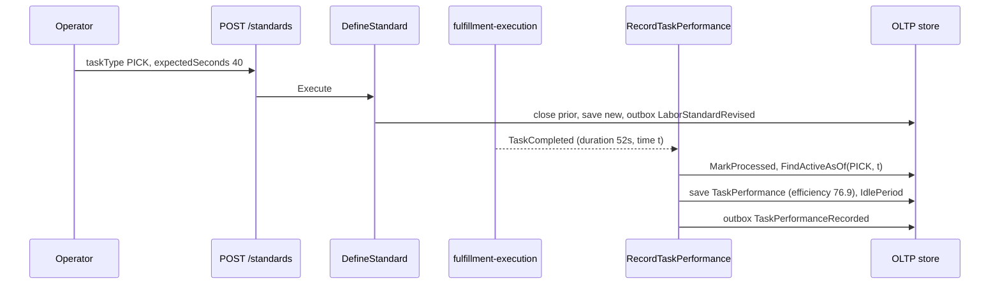

# Use cases

There is one struct per use case in `internal/application/usecases`. Each
depends only on the domain and on `internal/application/ports`. Writes
run inside a `UnitOfWork` when Postgres is configured
([ADR 0010](../adr/0010-transactional-outbox.md)). Without Postgres
(`UnitOfWork == nil`) the same steps run one after another.

| Use case | Trigger | Writes? | Events raised |
| --- | --- | --- | --- |
| [DefineStandard](#definestandard) | REST `POST /standards` | yes | `LaborStandardDefined` or `LaborStandardRevised` |
| [RecordTaskPerformance](#recordtaskperformance) | Kafka `TaskCompleted` on `warehouse.fulfillment.events` | yes | `TaskPerformanceRecorded` |
| [GetStandard](#getstandard) | REST `GET /standards/{taskType}`, MCP `get_labor_standard` | no | — |
| [GetAssociateScorecard](#getassociatescorecard) | REST `GET /associates/{associateId}/scorecard`, MCP `get_associate_scorecard`, MCP resource `scorecard://labor/{associateId}` | no | — |
| [GetTaskTypePerformance](#gettasktypeperformance) | REST `GET /task-types/{taskType}/performance`, MCP `get_task_type_performance` | no | — |
| [GetUtilization](#getutilization) | REST `GET /task-types/{taskType}/utilization`, `GET /associates/{associateId}/utilization`, MCP `get_task_type_utilization` | no | — |

No use case is triggered by a scheduler. The housekeeping sweeper and
the outbox relay are adapter-level jobs, not use cases
([Runbook](../operations/runbook.md)). The analytics projection
(`cmd/labor-projector`) is an adapter over `internal/analytics/report`,
also not an application use case.

## DefineStandard

`internal/application/usecases/define_standard.go`

- **Trigger:** `POST /standards` on `cmd/labor`. Never exposed over MCP.
- **Inputs:** `taskType` (`PICK`, `PACK` or `SLAM`, validated by
  `shared.NewTaskType` in the HTTP adapter, 400 otherwise),
  `expectedSeconds`, and an optional `travelComponentSeconds`. With a
  database, the `Idempotency-Key` header is required
  ([ADR 0016](../adr/0016-idempotency-key-middleware.md)).
- **Steps:**
  1. Load the currently active standard for the task type.
  2. Mint a new `StandardId`.
  3. `standard.New` checks the invariants: `expectedSeconds > 0`,
     `travelComponentSeconds >= 0`, and travel ≤ expected. A violation
     returns 422 and records `labor_performance.standards.defined{outcome="rejected"}`.
  4. Atomically, close the prior standard at `now` (it is never
     overwritten), save the new one, and publish the event.
  5. Record `outcome="accepted"`.
- **Concurrency invariants:** the `version` column gives optimistic
  locking on `Save` (409 `concurrent-modification`), and the unique
  partial index allows one open standard per `task_type` (409
  `standard-conflict`) ([ADR 0022](../adr/0022-optimistic-concurrency-one-open-standard.md)).
- **Events:** `LaborStandardDefined` when no standard was active,
  otherwise `LaborStandardRevised` (carrying `previous_expected_seconds`).
  Both go to `warehouse.labor-performance.analytics` only.

## RecordTaskPerformance

`internal/application/usecases/record_task_performance.go`

- **Trigger:** the Kafka consumer in `cmd/labor`, for
  `com.warehouse.wes.fulfillment-execution.task.TaskCompleted` only.
  There is deliberately no REST endpoint
  ([ADR 0003](../adr/0003-kafka-choreography-consumer-of-fulfillment-execution.md)).
- **Inputs:** `KafkaEventId` (CloudEvents `id`), `TaskId`, `AssociateId`
  (may be empty), `TaskType` (`ParseTaskTypeLenient`: an unknown or
  absent value becomes `""`), `ActualSeconds` (`duration_seconds`), and
  `CompletedAt` (CloudEvents `time`).
- **Steps, all in one unit of work:**
  1. `MarkProcessed(KafkaEventId)`. An id that was already processed
     returns `(nil, nil)`, a silent no-op.
  2. Resolve the standard active **as of `CompletedAt`**
     (`FindActiveAsOf`), not the current one. If there is none, or the
     task type is unclassified, the standard is 0
     ([ADR 0004](../adr/0004-standard-frozen-at-completion-time-not-recomputed.md)).
  3. `performance.New` requires a non-empty event id and task id.
     `EfficiencyPct = 100 × standard / actual`, or `nil` when either is
     ≤ 0. The value is frozen for good.
  4. Look up the associate's previous completion (skipped for an empty
     associate), then save the `TaskPerformance`.
  5. Derive the idle gap: `claimedAt = CompletedAt − ActualSeconds`. The
     gap runs from the previous completion to `claimedAt`, capped at
     `IDLE_GAP_CAP_SECONDS` (default 3600, `capped=true` when hit), and
     is saved as an `IdlePeriod`. A gap ≤ 0 (out-of-order delivery) is
     logged and skipped, never an error
     ([ADR 0014](../adr/0014-labor-utilization-idleness.md)).
  6. Publish `TaskPerformanceRecorded`.
- **Failure:** any error rolls everything back, including the
  `processed_events` claim, so the consumer's retry or the DLQ re-drive
  can process the event again.
- **Events:** `TaskPerformanceRecorded`, to
  `warehouse.labor-performance.analytics` (key TaskType) and
  `warehouse.labor-performance.events` (key AssociateId)
  ([ADR 0013](../adr/0013-labor-performance-integration-events.md)).

## GetStandard

`internal/application/usecases/get_standard.go`

- **Inputs:** `taskType`.
- **Returns:** the currently open `LaborStandard`, or
  `ErrStandardNotFound` (404 `standard-not-found`, or an MCP tool error).

## GetAssociateScorecard

`internal/application/usecases/get_associate_scorecard.go`

- **Inputs:** `associateId`.
- **Rules:** an empty id, or an associate with zero rows, returns
  `ErrAssociateNotFound` (404). An associate whose rows are all
  unscored gets a scorecard with `meanEfficiencyPct: null`, not a 404.
- **Computes:** task count, mean efficiency over scored rows, a
  per-TaskType breakdown, and, from the 10 most recent rows,
  `trend` (`ClassifyTrend`: the recent mean against the all-time mean,
  ±5 percentage points, needs at least 3 scored tasks, otherwise
  `INSUFFICIENT_DATA`) and `coachingFlag` (`DetectCoachingFlag`: the last
  3 scored tasks are all below 85%)
  ([ADR 0005](../adr/0005-associate-trend-and-coaching-flag.md)).

## GetTaskTypePerformance

`internal/application/usecases/get_task_type_performance.go`

- **Inputs:** `taskType` (must be a known type).
- **Returns:** always succeeds. `taskCount`, `meanEfficiencyPct` (scored
  rows only) and `meanActualSeconds` (measured rows, independent of any
  standard, [ADR 0006](../adr/0006-mean-actual-seconds-independent-of-standard.md)).
  A type that has never been seen returns count 0 and `null` means.

## GetUtilization

`internal/application/usecases/get_utilization.go`

- **Inputs:** a task type or an associate id, and a window. REST
  `?window=` takes a Go duration and MCP `windowSeconds` takes seconds.
  Absent, unparsable or ≤ 0 means **1h**.
- **`ForTaskType`:** sums `ActualSeconds` and recorded (closed) idle gaps
  for the task type since `now − window`, and counts distinct associates.
  `openGapSeconds` is always 0.
- **`ForAssociate`:** the same sums for one associate, plus the
  **open gap**: the time from the associate's last activity (last
  completion or last idle-gap end) to now, clamped to the window. It is
  computed at read time and never persisted.
- **Returns:** `utilizationPct = 100 × task / (task + idle + openGap)`,
  or `null` when there is nothing to divide.

## Sequence: define, then score

Source: `internal/application/usecases/define_standard.go`,
`internal/application/usecases/record_task_performance.go`.
