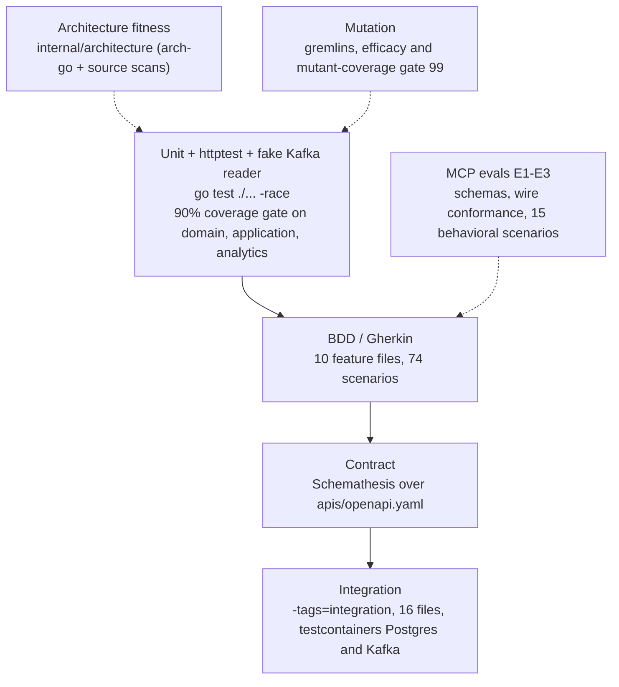

# Testing

Every `make` target mirrors a job in `.github/workflows/ci.yml`, so a
local pass predicts a CI pass. Two bundles cover most local runs:

```bash
make check       # fmt-check vet build lint test   (lefthook pre-push runs this)
make check-all   # check + coverage (90% gate) + arch-test + bdd
```

None of the default targets needs Docker, Postgres or Kafka. Only the
`integration` build tag starts containers.



Source: `Makefile`, `.github/workflows/ci.yml`, `features/`, `internal/**/*_test.go`.

## Unit tests

- **Command:** `make test` (`go test ./... -race`). CI job `test` also
  runs `go build ./...`, `go vet ./...` and a gofmt check.
- **Scope:** domain aggregates and pure functions (`ClassifyTrend`,
  `DetectCoachingFlag`, `idleness.New`, `UtilizationPct`), use cases over
  in-memory fakes (`internal/application/usecases/fakes_test.go`), HTTP
  handlers through `httptest` (`internal/adapters/inbound/http/*_test.go`),
  Kafka consumers over fake readers, golden-file tests for the CloudEvents
  wire format (`internal/adapters/outbound/kafka/golden_cloudevents_test.go`)
  and log publisher (`internal/adapters/outbound/events/testdata/*.json`),
  and the composition roots' wiring (`cmd/labor/wiring_test.go`,
  `cmd/mcp/wiring_test.go`).
- **Coverage gate:** `make coverage` runs with
  `-coverpkg=./internal/domain/...,./internal/application/...,./internal/analytics/...`
  and fails below **90%**. CI enforces it in the `test` job and uploads
  `coverage.out` as an artifact.

## BDD acceptance tests (godog)

- **Command:** `make bdd` (`go test ./... -run TestFeatures -v`). CI job:
  `bdd`.
- **Wiring:** `features_test.go` and `features_wave2_test.go` drive the
  real chi router (`httptest.NewServer(inboundhttp.NewRouter(...))`)
  over the in-memory adapters. Kafka-driven steps call
  `RecordTaskPerformance` directly.
- **Features:** 10 files under `features/`, 74 scenarios:

| File | Scenarios | Feature |
| --- | --- | --- |
| `features/performance_scoring.feature` | 13 | Scoring completed tasks and reading the scorecard |
| `features/scorecard.feature` | 1 | Reading an associate's performance scorecard |
| `features/standards.feature` | 5 | Defining and reading engineered labor standards |
| `features/standards_events_and_validation.feature` | 12 | Defining standards and the events that announce them |
| `features/task_type_performance.feature` | 2 | Reading fleet-wide TaskType performance |
| `features/task_type_performance_data.feature` | 9 | Reading fleet-wide performance for a task type |
| `features/travel_component.feature` | 5 | Declaring an optional travel component on a labor standard |
| `features/trend_and_coaching.feature` | 6 | Reading performance trends and coaching signals |
| `features/utilization.feature` | 4 | Reading idle-gap utilization over a trailing window |
| `features/utilization_data.feature` | 17 | Measuring utilization from recorded idle gaps |

A separate feature file,
`internal/adapters/inbound/mcp/testdata/features/mcp_tools.feature`
(15 scenarios), drives the MCP behavioral evals below.

## Integration tests (testcontainers)

- **Command:** `go test -tags=integration ./... -race -count=1`. CI job:
  `integration`, with no service containers: each test starts its own
  Postgres and/or Kafka through testcontainers-go on the runner's Docker.
- **Narrow target:** `make integration-kafka-testcontainers` runs
  `TestConsumer_ProjectsRealBrokerMessages` against an isolated Kafka
  container.
- **Files** (all `//go:build integration`, 16 in total):
  - Postgres repos: `internal/adapters/outbound/postgres/{integration,standard_repo,performance_repo,idle_period_repo}_integration_test.go`
  - outbox and relay: `outbox_integration_test.go`, `outbox_lag_integration_test.go`
  - sweeper: `sweeper_integration_test.go`
  - pool limits (`statement_timeout` really applied): `pool_limits_integration_test.go`
  - analytics store: `internal/adapters/outbound/analyticsstore/postgres_integration_test.go`
  - idempotency middleware, including concurrent same-key requests:
    `internal/adapters/inbound/http/idempotency_integration_test.go`,
    `idempotency_conflict_integration_test.go`
  - Kafka consumers and DLQ (real broker), including DLQ topic
    auto-creation: `internal/adapters/inbound/kafka/consumer_integration_test.go`,
    `consumer_dlq_integration_test.go`, `consumer_dlq_autocreate_integration_test.go`,
    `analytics_consumer_integration_test.go`
  - integration publisher: `internal/adapters/outbound/kafka/integration_publisher_integration_test.go`
- **Guard rails:** the fitness tests `TestPostgresIntegrationTestsUseTestcontainers`
  and `TestKafkaIntegrationTestsUseTestcontainers` fail the build if an
  integration test skips on `DATABASE_URL` or `KAFKA_BROKERS`, or
  hard-codes `localhost:9092`. A skip-gated test would silently prove
  nothing in CI.

## Contract tests (Schemathesis)

- **Command:** `make contract` (`scripts/contract-test.sh`). CI job:
  `contract`. Needs `st`: `python3 -m pip install 'schemathesis==4.28.0'`.
- **How:** builds `cmd/labor`, starts it in memory on `127.0.0.1:18083`
  (`CONTRACT_PORT`), waits for `/healthz`, then runs
  `st run apis/openapi.yaml --max-examples 100 --workers 4`
  (`CONTRACT_MAX_EXAMPLES` overrides the example count).
- **Excluded operations:** `defineStandard` (the cross-field rule
  travel ≤ expected cannot be expressed in OpenAPI 3.0.3), and
  `getTaskTypeUtilization`/`getAssociateUtilization` (the service ignores
  unknown query params on purpose). The script comments name the unit
  tests that cover these instead.
- `apis/openapi-reports.yaml` has no contract run. It is linted by
  `api-lint` and covered by `reports_handler_test.go`.

## MCP evals (E1–E3)

- **Command:** `go test ./internal/adapters/inbound/mcp/... -race -run '^TestEval|^TestMCPEvalSuite' -v`.
  CI job: `evals-tests`. The same tests also run in the `test` job.
- **E1, schemas and metadata** (`eval_governance_test.go`): input schemas
  resolve and reject wrong types, every parameter has a description, the
  tool list matches `testdata/tool_registry.golden`, and tool names are
  unique across `testdata/fleet_tool_snapshot.golden`.
- **E2, wire conformance** (`eval_conformance_test.go`, 9 tests): the
  initialize handshake, rejection of unknown tools, wrong-typed or extra
  arguments, unknown resources and prompts, discovery of the resource
  template and prompt, and the closed-session behaviour.
- **E3, behavioral** (`evalsuite_test.go`, `TestMCPEvalSuite`): runs the
  15 scenarios in `testdata/features/mcp_tools.feature`.
- `governance_test.go` enforces the charter: at most 8 tools, `verb_noun`
  names, annotations and descriptions present
  ([ADR 0030](../adr/0030-mcp-eval-and-governance-gates.md)).

## Mutation testing (gremlins)

- **Config:** `.gremlins.yaml`, with `workers: 1`, `timeout-coefficient: 30`,
  thresholds `efficacy: 99` and `mutant-coverage: 99`. gremlins fails when
  the measured value is at or below the threshold, so effectively 100% is
  required.
- `make mutation-fast` runs `gremlins unleash ./internal/domain/performance`.
  CI job `mutation-fast` runs on every push and PR and blocks merges.
- `make mutation` runs `gremlins unleash ./internal/domain --workers 1 --timeout-coefficient 30`.
  CI job `mutation` runs only on the weekly schedule (Monday 06:00 UTC)
  or by `workflow_dispatch`. A scheduled failure opens or refreshes a
  `harness:red` issue through `scripts/harness/red_issue.py`.
- gremlins v0.6.0 is pinned in the Makefile and CI.

## Architecture fitness tests

- **Command:** `make arch-test` (`go test ./internal/architecture/... -v`).
  CI job: `arch-test` ([ADR 0026](../adr/0026-arch-go-fitness-suite.md)).

| Test | Enforces |
| --- | --- |
| `TestHexagonalArchitecture` | arch-go dependency rules: domain imports nothing, application only domain, analytics isolated from OLTP. |
| `TestMCPAdapterDependencyRule` | The MCP adapter depends only on the application layer. |
| `TestNoAuthMiddlewareReintroduced` | No REST/MCP auth middleware comes back ([ADR 0012](../adr/0012-remove-rest-auth-layer.md)). |
| `TestNoSiblingContextOutboundCalls` | `internal/adapters/outbound` never imports `net/http` as a client, so there are no synchronous calls to sibling contexts. |
| `TestKafkaConsumerGroupNeverHardcodedInline` | A kafka-go `GroupID` is never assigned an inline string literal. It must come from a named constant, a variable or a function call. |
| `TestKafkaIntegrationTestsUseTestcontainers`, `TestPostgresIntegrationTestsUseTestcontainers` (+ fixture self-test) | Integration tests start their own containers. |
| `TestNoStructTagsInDomain` (+ fixture self-test) | No JSON or db struct tags in `internal/domain`. |
| `TestCloudEventsOnly` | Kafka code uses the CloudEvents SDK (no hand-built envelopes), and nothing mentions the retired `EVENT_ENVELOPE_MODE` toggle. |
| `TestReplayConsumersSetCommitInterval` | A full-replay consumer whose group id comes from a "unique group" function call must set `CommitInterval`. |
| `TestEventCatalogueMatchesContract`, `TestEventCatalogueDetector` | Every CloudEvents `type` that `apis/asyncapi.yaml` declares for this service also appears in a CloudEvents ADR under `docs/docs/adr/`. |

## Other CI jobs

| Job | Runs | When |
| --- | --- | --- |
| `lint` | golangci-lint v2.13.1 (`.golangci.yml`) | push/PR |
| `complexity` | golangci-lint `--enable-only gocyclo,gocognit,cyclop,funlen,nestif`, plus an informational gocyclo report | push/PR |
| `guide-lint` | `scripts/harness/guide_lint.py`, `repo_lint.py` and their tests (`make guide-lint`, `make harness-test`) | push/PR |
| `api-lint` | Spectral on `apis/openapi.yaml`, `apis/openapi-reports.yaml` (`.spectral.yaml`) and `apis/asyncapi.yaml` (`.spectral.asyncapi.yaml`). `make api-lint`. | push/PR |
| `vuln` | govulncheck v1.7.0 (`make vuln`) | push/PR |
| `docs-api-drift` | In `docs/`: `npm ci`, `npm run clean-api-docs:all && npm run gen-api-docs:all`, then fails on any diff under `docs/api-reference/rest` or `rest-reports` | push/PR |
| `web` | In `web/`: builds `IQVO/warehouse-ui-kit@develop`, then `npm ci`, `npm run lint`, `npx tsc -b`, `npm test` (vitest), `npm run build` | push/PR |
| `drift` | deadcode, `go mod tidy -diff`, knip on `web/`, and a coverage-quality cross-check (`scripts/coverage-quality.py`). Advisory. | schedule / dispatch |
| `helm-lint` | `ct lint --charts charts/labor-performance` | PRs into `main` only |
| `trivy-scan` | Builds the image and gates on CRITICAL/HIGH CVEs that have a fix | PRs into `main` only |
| `docker-publish`, `release` | GHCR image (cosign-signed, SPDX SBOM), git tag, Helm chart to `oci://ghcr.io/iqvo` | push to `main` only |

Separate workflows: `codeql.yml` (CodeQL), `scorecard.yml` (OpenSSF
Scorecard), `ai-review.yml`, and `docs.yml`, which builds and deploys
this site to GitHub Pages on pushes to `main` only. **No PR job builds the
Docusaurus site.** Run `npm run build` in `docs/` yourself before merging
docs changes.

Chart checks that are not wired into CI:
`python3 charts/labor-performance/tests/test_service_selectors.py` (every
Service selects exactly one component) and
`charts/labor-performance/tests/render-assertions.sh`.

## Git hooks

`lefthook.yml` defines `pre-commit` (fmt-check, vet, lint) and `pre-push`
(`make check`). Hooks are not tracked by git. Activate them once per clone
or worktree with `lefthook install`.
