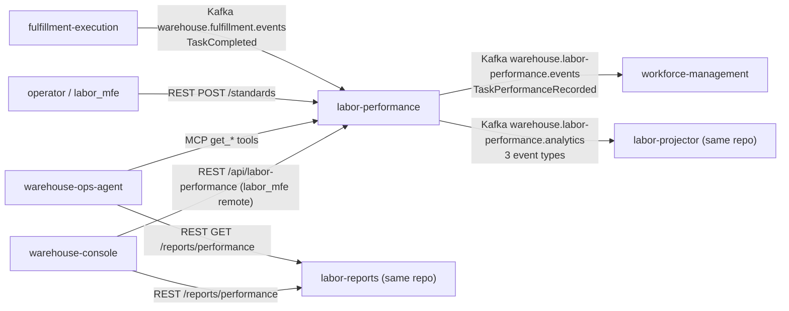

# Integration

labor-performance takes data in **only** by consuming Kafka and through
its own inbound REST API. Other contexts read from it through its topics,
its REST and reports APIs, and its MCP server. It makes **no outbound
REST or MCP call to any sibling**. The fitness test
`TestNoSiblingContextOutboundCalls` forbids an outbound HTTP client in
`internal/adapters/outbound`. For the DDD relationship analysis, see the
[Context map](./context-map.md).

Source: `internal/adapters/kafka/cloudevents/cloudevents.go`,
`internal/adapters/inbound/*`, and the consumer code in the sibling repos
cited below.

## Upstream

| Upstream | Protocol | Contract | How it is consumed | Failure behaviour |
| --- | --- | --- | --- | --- |
| `fulfillment-execution` | Kafka, CloudEvents 1.0 structured | Topic `warehouse.fulfillment.events`, type `com.warehouse.wes.fulfillment-execution.task.TaskCompleted`. `data` fields used: `task_id`, `associate_id`, `duration_seconds`, `task_type`. `station_id` and `work_unit_id` are decoded but not used. The completion instant is the CloudEvents `time`, and the dedupe key is the CloudEvents `id`. | `cmd/labor`, group `KAFKA_CONSUMER_GROUP` (default `labor-performance`). It is a Conformist to this shared fan-out topic. Every other `type` on the topic is ignored. | Invalid CloudEvent: straight to `warehouse.fulfillment.events.dlq` and committed. Handler error: 3 attempts, then DLQ and commit. DLQ or commit failure: the consumer stops, the pod restarts and the message is redelivered. Missing `associate_id`, `task_type` or duration degrade to unattributed, unclassified or unscored. They are never rejected. |
| Operators (`labor_mfe` remote, curl) | REST, `apis/openapi.yaml` | `POST /standards` with `Idempotency-Key` | `cmd/labor` | RFC 7807 errors ([Troubleshooting](../operations/troubleshooting.md#problem-types)). |

Absent upstreams, on purpose:

- **No standard comes from another context.** Industrial engineering
  defines standards through `POST /standards`. An optional
  `travelComponentSeconds` can be supplied by the caller, for example
  from `facility-layout`'s travel estimate, but this service never fetches
  it ([ADR 0015](../adr/0015-optional-travel-component-on-labor-standard.md)).
- **No dependency on `workforce-management`** (shifts, paths) **or on
  `process-path-management`.** The fleet bans REST and MCP calls from
  this context to siblings.

## Downstream

| Downstream | Protocol | Contract | What it does with it | Failure behaviour |
| --- | --- | --- | --- | --- |
| `workforce-management` | Kafka | Topic `warehouse.labor-performance.events`, type `com.warehouse.wes.labor-performance.performance.TaskPerformanceRecorded`, `dataschema` `urn:warehouse:labor-performance:events:TaskPerformanceRecorded:v1`, key `AssociateId` ([ADR 0013](../adr/0013-labor-performance-integration-events.md)) | Builds a measured-rate and idle-share cache (`internal/adapters/outbound/laborperformancecache` in that repo, group prefix `workforce-management-labor-performance-cache`). | Fed only when `EVENT_PUBLISHER=kafka`. With the outbox, events wait in `outbox_events` while the broker is down and are delivered later at least once, with a stable CloudEvents `id`. |
| `labor-projector` (this repo) | Kafka | Topic `warehouse.labor-performance.analytics`: `com.warehouse.wes.labor-performance.standard.LaborStandardDefined`, `com.warehouse.wes.labor-performance.standard.LaborStandardRevised`, `com.warehouse.wes.labor-performance.performance.TaskPerformanceRecorded`, with `dataschema` `urn:warehouse:labor-performance:analytics:<EventName>:v1` and key `TaskType` | Rollup in the analytical database ([ADR 0007](../adr/0007-analytical-data-product.md)). | Same outbox guarantees. The projector retries transient errors forever and skips bad input. |
| `warehouse-ops-agent` | MCP (Streamable HTTP) | `get_associate_scorecard`, `get_task_type_performance`, `get_labor_standard`, `get_task_type_utilization` ([MCP tools](../mcp/tools.md)) | Its `FlowBalanceAdvisory` overlays `get_task_type_utilization` on rebalance recommendations. It is configured on its side through `LABOR_PERFORMANCE_MCP_ENDPOINT`. | On the agent's side, a missing or unreachable endpoint skips the utilization overlay. Nothing on this side depends on it. |
| `warehouse-ops-agent` | REST (reports) | `GET /reports/performance`, `GET /reports/performance/freshness` (`apis/openapi-reports.yaml`) | Console report section "Labor Performance (Efficiency %)", configured through `LABOR_PERFORMANCE_REPORTS_REST_URL` on its side. | The agent degrades only that section ("labor-performance reports not available"). |
| `warehouse-console` | Module Federation and REST | Remote `labor_mfe/App` mounted at `/labor`, OLTP API base `/api/labor-performance` (Kong). The context-reports page reads `/reports/performance` and `/reports/performance/freshness`. | Operator screens and the WES dashboard report card. | CORS through `CORS_ALLOWED_ORIGINS`. Each card shows its freshness lag. |

`e2e-tests` also checks this context's topics in its warehouse-day
verification. That is a test harness, not a runtime consumer.

## Event payloads

`TaskPerformanceRecorded` (both topics, snake_case `data`):

| Field | Type | Notes |
| --- | --- | --- |
| `task_id` | string | |
| `associate_id` | string | Empty for robot stations. The CloudEvents `subject` falls back to `task_id` in that case. |
| `task_type` | string | `PICK`, `PACK`, `SLAM`, or `""` when unclassified |
| `efficiency_pct` | number or null | `null` = unscorable, never 0 |
| `actual_seconds` | integer | |
| `idle_seconds_before` | integer or null | Idle gap before this task. `null` = not observed. |
| `completed_at` | RFC 3339 | Business time. Feeds the hour bucket. |

`LaborStandardDefined` / `LaborStandardRevised` (analytics topic only)
carry `standard_id`, `task_type`, `expected_seconds`, `effective_from`,
an optional `travel_component_seconds`, and on revisions
`previous_expected_seconds`. The `subject` is the `StandardId`. Field
definitions are in [Domain events](../ddd/domain-events.md) and
`apis/asyncapi.yaml`.

## Compatibility rules

- Every message is CloudEvents 1.0 in structured mode, with header
  `content-type: application/cloudevents+json; charset=UTF-8`
  ([ADR 0021](../adr/0021-cloudevents-mandatory-event-envelope.md)).
- Consumers must dedupe on the CloudEvents `id`. Outbox delivery is
  at-least-once and a resend keeps the same `id`.
- Payload changes are additive. `idle_seconds_before` was added without
  a version bump, and `workforce-management`'s consumer tolerates unknown
  fields. A breaking change needs a new `dataschema` version.
- Ordering holds only per partition key: `AssociateId` on `.events`,
  `TaskType` on `.analytics`.
