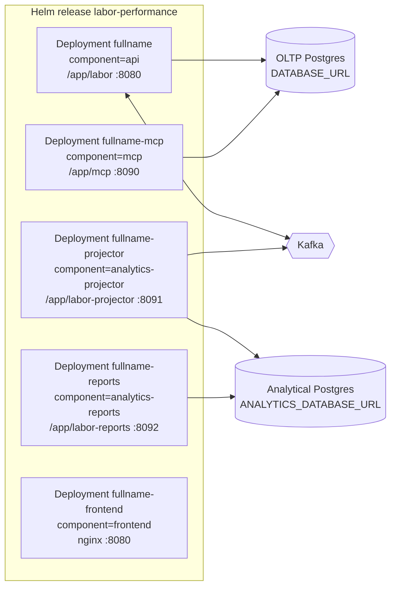

# Operations runbook

This runbook covers what an operator needs to deploy and run
labor-performance. Everything here comes from the code and the Helm chart
on `develop`. Environment variables are listed in
[Configuration](./configuration.md). Metrics and alerts are in
[Observability](./observability.md). Symptom-driven fixes are in
[Troubleshooting](./troubleshooting.md).

## Deployment

The Helm chart is `labor-performance` (`charts/labor-performance`, chart
`version` 0.1.0 on `develop`). The `release` CI job packages it and pushes
it to `oci://ghcr.io/iqvo` on every merge to `main`. One container image,
`ghcr.io/iqvo/labor-performance`, holds all four binaries (`/app/labor`,
`/app/labor-projector`, `/app/labor-reports`, `/app/mcp`) and both
migration directories. Its `ENTRYPOINT` is `./labor`. The other
Deployments override `command`.



Source: `charts/labor-performance/templates/*.yaml`, `cmd/*/main.go`.

| Workload | Deployment / component | Enabled by | Command | Container port | Service | Probes |
| --- | --- | --- | --- | --- | --- | --- |
| OLTP API (`cmd/labor`) | `<fullname>`, `component=api` | always | image entrypoint `./labor` | `http` 8080 (`service.targetPort`) | `<fullname>` ClusterIP, port 80 → `http` | startup `GET /healthz` (every 2s, 30 failures allowed), liveness `GET /healthz`, readiness `GET /readyz` |
| Analytics projector (`cmd/labor-projector`) | `<fullname>-projector`, `component=analytics-projector` | `analytics.enabled=true` | `/app/labor-projector` | `admin` 8091 (hard-coded in the template) | none | startup, liveness and readiness all `GET /healthz` on `admin` |
| Reports reader (`cmd/labor-reports`) | `<fullname>-reports`, `component=analytics-reports` | `analytics.enabled=true` | `/app/labor-reports` | `http` 8092 | `<fullname>-reports` ClusterIP, port 80 → `http` | startup, liveness and readiness all `GET /healthz` |
| MCP server (`cmd/mcp`) | `<fullname>-mcp`, `component=mcp` | `mcp.enabled=true` | `/app/mcp` | `http` 8090 | `<fullname>-mcp` ClusterIP, port 8090 → `http` | `tcpSocket` for startup, liveness and readiness |
| Operator remote (`web/`, `labor_mfe`) | `<fullname>-frontend`, `component=frontend` | `frontend.enabled=true` | nginx-unprivileged | 8080 | `<fullname>-frontend` ClusterIP, port 80 | see the chart |

`charts/labor-performance/tests/test_service_selectors.py` asserts that
every Service selects exactly one component. `ingress.enabled` and
`gatewayApi.enabled` (an `HTTPRoute`, [ADR 0028](../adr/0028-gateway-api-httproute.md))
are both `false` by default, and both route only to the api Service. In
the fleet's kind cluster, Kong exposes the API on `:8000` under
`/api/labor-performance`, and the Nginx web gateway serves the remote at
`/mfes/labor-performance/`. That routing lives in `warehouse-infra`, not
in this chart.

### What the probes actually check

- `GET /healthz` (api, reports, projector admin, mcp) always returns
  `200 {"status":"ok"}`. It checks nothing downstream.
- `GET /readyz` (api only) returns `200 {"status":"ready"}` until
  `SIGTERM`, then `503 {"status":"not_ready"}`. It does **not** check
  Postgres or Kafka either.
- Boot order is what makes a successful probe meaningful. Each binary runs
  its migrations and pings its pool (both retried by `bootretry`: 5
  attempts, about 31s) **before** it starts listening. If any of that
  fails, the process exits non-zero instead of serving. So once a pod
  answers its probes, migrations have been applied and the database was
  reachable at boot. Kafka is never checked: the consumer and relay start
  in the background and keep retrying.
- The `startupProbe` allows up to 60s (`periodSeconds` 2 × `failureThreshold`
  30). That leaves room for the boot retry to outlast the fleet's known
  ~10s first-dial reset from Istio native sidecars
  ([ADR 0027](../adr/0027-bootretry-and-startup-probe.md)).
- `cmd/mcp` now has its own `GET /healthz`, but the chart still probes
  the MCP pod with `tcpSocket`. The template comment saying there is no
  `/healthz` route is out of date.

### Graceful shutdown (`cmd/labor`)

On `SIGTERM` or `SIGINT`, `cmd/labor` ([ADR 0017](../adr/0017-kafka-dlq-and-graceful-shutdown.md)):

1. flips `/readyz` to 503;
2. calls `http.Server.Shutdown` with a 10s budget;
3. stops the outbox relay and waits for its in-flight pass;
4. cancels the Kafka consumer and waits for the message in hand to finish
   and commit its offset;
5. closes the consumer, the publishers and the pool, in that order. The
   telemetry flush gets another 5s.

`terminationGracePeriodSeconds` is 30 on the api Deployment. The other
binaries cancel their loops and shut the HTTP server down with the same
10s budget.

## Migrations

| Schema | Files | Run by | When | Connection |
| --- | --- | --- | --- | --- |
| OLTP | `migrations/0001_init` … `0006_standard_version_and_one_open` | `cmd/labor` **and** `cmd/mcp` (`postgres.RunMigrations`) | every process start, before the pool opens | `MIGRATIONS_DATABASE_URL`, falling back to `DATABASE_URL` |
| Analytical | `migrations/analytics/0001_report` | `cmd/labor-projector` only | every process start | `ANALYTICS_DATABASE_URL` |

golang-migrate applies only pending `up` migrations (`ErrNoChange` is
not an error) and takes a Postgres advisory lock. That lock is why
replicas starting together do not race, as long as the migration DSN is a
**direct** connection. Through PgBouncer transaction pooling, the lock
does not hold. Losing replicas then crash-loop with `unnamed prepared
statement does not exist` or `canceling statement due to statement
timeout`. Set `MIGRATIONS_DATABASE_URL` to the direct DSN
([ADR 0020](../adr/0020-migrations-direct-postgres-connection.md)).
`cmd/labor-reports` never migrates.

There is no migration Job and nothing in the code runs `down` migrations.
To roll back, run the golang-migrate CLI by hand against the direct DSN
and the matching `*.down.sql`.

Tables created by the migrations:

| Database | Table | Purpose |
| --- | --- | --- |
| OLTP | `labor_standards` | Append-only standard history. `travel_component_seconds` was added in 0004. `version` and a unique partial index allowing one open standard per `task_type` came in 0006 ([ADR 0022](../adr/0022-optimistic-concurrency-one-open-standard.md)). |
| OLTP | `task_performances` | One scored completion per CloudEvents `id` (`event_id` primary key). |
| OLTP | `processed_events` | Consumer idempotency set: CloudEvents ids already applied. |
| OLTP | `idle_periods` | Derived between-task idle gaps (`capped` flag, [ADR 0014](../adr/0014-labor-utilization-idleness.md)). |
| OLTP | `outbox_events` | Transactional outbox rows (`published_at`, `attempts`, `last_error`). |
| OLTP | `idempotency_keys` | Cached `POST /standards` outcomes per `Idempotency-Key` ([ADR 0016](../adr/0016-idempotency-key-middleware.md)). |
| Analytical | `labor_performance_rollup` | One row per (`task_type`, `hour_bucket`) holding raw counters and sums. Means are computed at read time. |
| Analytical | `analytics_processed_events` | Ids the projection has applied, with `occurred_at` (drives freshness). |
| Analytical | `analytics_consumed_events` | Consumer-level dedupe set for the analytics consumer. |

## Kafka

Every message this service produces or consumes is a CloudEvents 1.0
event in **structured** content mode, with Kafka header
`content-type: application/cloudevents+json; charset=UTF-8`
(`internal/adapters/kafka/cloudevents`,
[ADR 0021](../adr/0021-cloudevents-mandatory-event-envelope.md)). The
fleet runs a single broker. From a host machine it is reachable at
`localhost:9092` through the kind cluster's external access.

| Topic | Direction | Binary | Consumer group / key | CloudEvents `type`s | Notes |
| --- | --- | --- | --- | --- | --- |
| `warehouse.fulfillment.events` | consume | `cmd/labor` | `KAFKA_CONSUMER_GROUP` (default `labor-performance`) | `com.warehouse.wes.fulfillment-execution.task.TaskCompleted` | Every other type is ignored and committed. Up to 3 in-process attempts, then the DLQ. |
| `warehouse.fulfillment.events.dlq` | produce | `cmd/labor` | key = original key | raw original payload | Headers carry the original headers plus `x-dlq-source-topic`, `x-dlq-error` and `x-dlq-failed-at`. Auto-created on first write. |
| `warehouse.labor-performance.analytics` | produce | `cmd/labor` (`EVENT_PUBLISHER=kafka`) | key = `TaskType` | `com.warehouse.wes.labor-performance.standard.LaborStandardDefined`, `com.warehouse.wes.labor-performance.standard.LaborStandardRevised`, `com.warehouse.wes.labor-performance.performance.TaskPerformanceRecorded` | `dataschema` `urn:warehouse:labor-performance:analytics:<EventName>:v1`. |
| `warehouse.labor-performance.events` | produce | `cmd/labor` (`EVENT_PUBLISHER=kafka`) | key = `AssociateId` (empty for robot stations) | `com.warehouse.wes.labor-performance.performance.TaskPerformanceRecorded` | Integration topic ([ADR 0013](../adr/0013-labor-performance-integration-events.md)). `dataschema` `urn:warehouse:labor-performance:events:TaskPerformanceRecorded:v1`. |
| `warehouse.labor-performance.analytics` | consume | `cmd/labor-projector` | `labor-performance-analytics` (constant), `StartOffset=FirstOffset` | the three types above | No DLQ. Invalid CloudEvents and undecodable payloads are logged and skipped. Infrastructure errors are retried forever (200ms → 5s backoff) without committing ([ADR 0031](../adr/0031-analytics-consumer-atomic-claim-and-retry.md)). |

Every writer uses `RequiredAcks=RequireAll`, a 10ms `BatchTimeout`, the
key-aware `Hash` balancer and `AllowAutoTopicCreation`
([ADR 0018](../adr/0018-kafka-writer-hash-balancer.md),
[ADR 0029](../adr/0029-kafka-writer-durability.md)).

### Fulfillment consumer and DLQ

For each message, `internal/adapters/inbound/kafka/consumer.go`:

1. decodes the CloudEvent. If it is invalid (bad JSON, missing attribute,
   the retired flat envelope), the message is written to the DLQ once and
   the offset is committed;
2. ignores any `type` other than `TaskCompleted` and commits;
3. runs `RecordTaskPerformance` up to 3 times (backoff from 100ms up to
   2s). On success it commits. When all attempts fail, it writes the
   message to the DLQ and commits;
4. stops the consume loop only on a commit failure or a DLQ write
   failure, after the DLQ writer has retried for up to 40 × 250ms while
   an auto-created DLQ topic gets a leader. The process then exits with
   the error and Kubernetes restarts it. The uncommitted message is
   redelivered.

Redelivery is safe. `RecordTaskPerformance` claims the CloudEvents `id`
in `processed_events` inside the same transaction as the performance row,
idle gap and outbox insert, so a duplicate is a no-op.

### Outbox relay

With `DATABASE_URL` set and `EVENT_PUBLISHER=kafka`, use cases write
encoded messages into `outbox_events` in the same transaction as the
aggregate change. A relay goroutine in every `cmd/labor` replica then:

- claims up to 100 unpublished rows, oldest first, with
  `FOR UPDATE SKIP LOCKED`, so replicas never claim the same row;
- sends them one at a time. A sent row gets `published_at = now()` and
  `attempts + 1`;
- on the first send failure, records `attempts + 1` and `last_error` on
  that row, commits what was already sent, logs `outbox relay pass failed`,
  and retries after `OUTBOX_RELAY_INTERVAL`. Later rows wait, which keeps
  per-key ordering;
- after a full batch, runs the next pass immediately. Otherwise it sleeps
  for `OUTBOX_RELAY_INTERVAL`.

Delivery is at-least-once. The stored message value already contains the
CloudEvents `id`, so a resend carries the same id and consumers dedupe
on it. Outbox lag is exported as
`labor_performance.outbox.lag_seconds` (see [Observability](./observability.md)).

With `EVENT_PUBLISHER=kafka` but **no** database, the publishers write
straight to Kafka and a broker error fails the request. With
`EVENT_PUBLISHER=log`, which is the chart default, nothing reaches Kafka
at all. That means neither the projector nor `workforce-management`
receives events.

### Housekeeping sweeper

With a database configured, `cmd/labor` runs a sweeper
([ADR 0023](../adr/0023-housekeeping-sweeper.md)). It runs once at boot,
then every `HOUSEKEEPING_INTERVAL`, and deletes in batches of 1000:

- `idempotency_keys` older than `IDEMPOTENCY_KEY_TTL` (by `created_at`);
- `outbox_events` **published** longer ago than `OUTBOX_RETENTION`.
  Unpublished rows are never deleted.

It logs `housekeeping sweep` with `idempotency_keys_deleted` and
`outbox_events_deleted` when it deletes anything, and
`housekeeping sweep failed` on error. Several replicas can run it at
once safely. `0` does **not** disable it (see
[Configuration](./configuration.md#zero-does-not-disable-housekeeping)).

## Reports API (`cmd/labor-reports`)

These routes are served by the reader binary and specified in
`apis/openapi-reports.yaml`, not in `apis/openapi.yaml`. Generated
reference:
[Reports API Reference](/docs/api-reference/rest-reports/labor-performance-reports-api).
They are unauthenticated and `GET` only. CORS uses `CORS_ALLOWED_ORIGINS`.

### `GET /reports/performance`

| Query param | Required | Format | Behaviour |
| --- | --- | --- | --- |
| `from` | yes | RFC 3339 | Inclusive lower bound, compared against `hour_bucket`. |
| `to` | yes | RFC 3339 | Exclusive upper bound. Must be strictly after `from`. |
| `taskType` | no | string | Exact match against the stored task type, which the projector normalised to upper case (`PICK`, `PACK`, `SLAM`, `UNCLASSIFIED`). A lower-case value matches nothing. |
| `granularity` | no | `hour` | The only accepted value. Anything else returns 400. |

Response `200 application/json`, from `internal/adapters/inbound/http/reports_handler.go`:

```json
{
  "from": "2026-10-09T00:00:00Z",
  "to": "2026-10-09T12:00:00Z",
  "rows": [
    {"taskType": "PICK", "hourBucket": "2026-10-09T08:00:00Z",
     "tasksRecorded": 40, "tasksScored": 38, "tasksUnscored": 2, "tasksMeasured": 40,
     "meanEfficiencyPct": 93.4, "meanActualSeconds": 48.1,
     "standardsDefined": 0, "standardsRevised": 1}
  ],
  "byTaskType": [
    {"taskType": "PICK", "tasksRecorded": 40, "tasksScored": 38, "tasksUnscored": 2,
     "tasksMeasured": 40, "meanEfficiencyPct": 93.4, "meanActualSeconds": 48.1,
     "standardsDefined": 0, "standardsRevised": 1}
  ],
  "totals": {"tasksRecorded": 40, "tasksScored": 38, "tasksUnscored": 2,
             "tasksMeasured": 40, "meanEfficiencyPct": 93.4, "meanActualSeconds": 48.1}
}
```

The numbers above are only an example. `meanEfficiencyPct` and
`meanActualSeconds` are `null` when nothing in the bucket was scored or
measured, never `0`. `rows` and `byTaskType` are `[]` for an empty
window. Errors are RFC 7807:

- 400 `…/invalid-report-query` for a missing or malformed `from`/`to`,
  `to <= from`, or a bad `granularity`;
- 500 `…/report-store-error` for a database failure.

### `GET /reports/performance/freshness`

Returns `200 {"lagSeconds": <float>}`: now minus `max(occurred_at)` in
`analytics_processed_events`. It is `0` when the read model is empty.
This is the data product's freshness signal. A growing value means the
projector has stopped applying events. Errors return 500
`…/report-store-error`.

### `GET /healthz`

`200 {"status":"ok"}`.

## Scaling

| Workload | HPA block | Default | Notes |
| --- | --- | --- | --- |
| api | `autoscaling.api` | off, 1–4 replicas, 70% CPU | Safe at N>1. The consumer group shares partitions, and the relay uses `SKIP LOCKED`. With the HPA on, the Deployment renders without `replicas:`. |
| projector | `autoscaling.projector` | off, 1–2 | Writes are idempotent per CloudEvents id. Ordering holds only per partition (key = TaskType). |
| reports | `autoscaling.reports` | off, 1–3 | Stateless and read-only. |
| frontend | `autoscaling.frontend` | off, 1–3 | Static assets. |
| mcp | none, `mcp.replicaCount` | 1 | The go-sdk Streamable HTTP handler keeps session state in memory. With more than one replica and no session affinity, a session can land on a pod that does not know it. |

Postgres connection budget ([ADR 0019](../adr/0019-horizontal-autoscaling-and-pgxpool-tuning.md)):
api up to 4 × 10 = 40 OLTP connections through PgBouncer, plus mcp
1 × 10. Projector up to 2 × 5 and reports up to 3 × 5 connect **direct**
to the analytical database. The shared instance's `max_connections` is
100.

## Routine procedures

Release names below assume `labor-performance` in namespace
`labor-performance`. Adjust to your install.

### Restart after a secret or credential rotation

Env vars are read once at process start, and the pod template only has a
checksum for the ConfigMap, not for the Secrets. After rotating
`DATABASE_URL`, `MIGRATIONS_DATABASE_URL`, `ANALYTICS_DATABASE_URL` or
`ANALYTICS_READER_DATABASE_URL`, restart the affected Deployments:

```bash
kubectl -n labor-performance rollout restart deployment/labor-performance
kubectl -n labor-performance rollout restart deployment/labor-performance-mcp
kubectl -n labor-performance rollout restart deployment/labor-performance-projector deployment/labor-performance-reports
```

### Re-drive dead-lettered `TaskCompleted` messages

1. Read the DLQ and check `x-dlq-error`:
   `kcat -C -b localhost:9092 -t warehouse.fulfillment.events.dlq -f '%h\n%s\n\n' -e`.
2. Errors that start with `cloudevents: message is not a valid CloudEvents 1.0 event`
   are poison messages, and replaying them will fail again. Fix the
   producer instead.
3. For transient failures (database down, timeouts), fix the cause, then
   publish the **raw value unchanged** back to `warehouse.fulfillment.events`
   with header `content-type=application/cloudevents+json; charset=UTF-8`.
   A failed attempt rolled back its `processed_events` claim, so the
   replayed id is processed. An id that did succeed is skipped as a
   duplicate.

### Re-publish outbox rows

Stuck rows are rows with `published_at IS NULL` and `attempts > 0`.
Inspect them with:

```sql
SELECT id, topic, event_type, attempts, last_error, created_at
FROM outbox_events WHERE published_at IS NULL ORDER BY id LIMIT 20;
```

The relay retries them by itself once the broker is healthy. To resend a
row that was already published (for example, after a downstream topic
was recreated), set `published_at = NULL` on it. The relay sends it again
with its original CloudEvents id, so idempotent consumers ignore it if
they already have it. Rows are only resendable within `OUTBOX_RETENTION`.

### Rebuild the analytical read model

The analytical schema is a projection of
`warehouse.labor-performance.analytics` and can be rebuilt from it, as
far back as the topic's retention reaches. Retention is set in
`warehouse-infra`, not in this repo.

1. Scale the projector to 0:
   `kubectl -n labor-performance scale deployment/labor-performance-projector --replicas=0`.
2. Empty all three tables in one statement:
   `TRUNCATE labor_performance_rollup, analytics_processed_events, analytics_consumed_events;`.
   If the dedupe tables keep their rows, every replayed event is
   skipped as already seen.
3. Reset the group:
   `kafka-consumer-groups.sh --bootstrap-server localhost:9092 --group labor-performance-analytics --topic warehouse.labor-performance.analytics --reset-offsets --to-earliest --execute`.
4. Scale the projector back up and watch
   `GET /reports/performance/freshness` drop.

### Replay `TaskCompleted` into the OLTP store

Resetting the `labor-performance` group on `warehouse.fulfillment.events`
to an earlier offset is safe, because every id already in
`processed_events` is skipped. New ids are scored against the standard
active **at their `time`**, not the current one
([ADR 0004](../adr/0004-standard-frozen-at-completion-time-not-recomputed.md)).
Stop the api pods (or scale them to 0) before resetting. A group with
active members cannot be reset.
