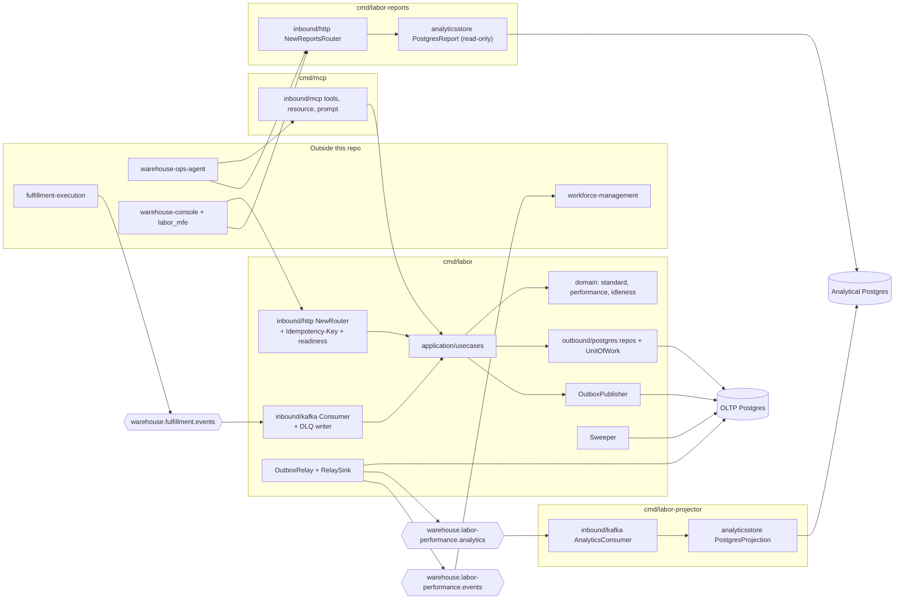
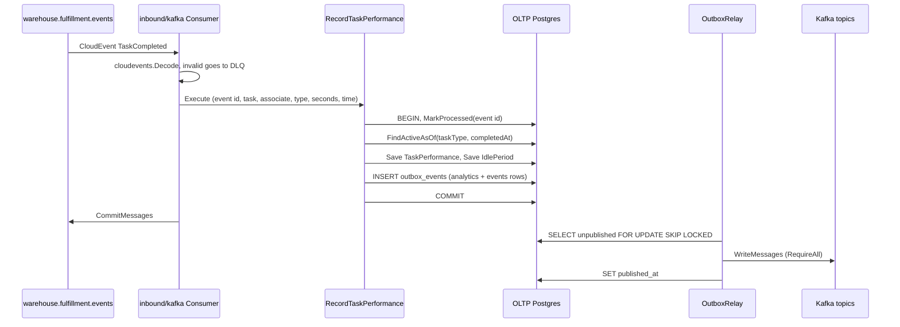

# Architecture

labor-performance is a hexagonal (ports and adapters) Go service
([ADR 0001](../adr/0001-hexagonal-ports-and-adapters.md)). Dependencies
point inward only: **domain depends on nothing, application depends on
domain, adapters depend on application and domain**. The analytical read
model (`internal/analytics`) is isolated from the OLTP code in both
directions. `internal/architecture` enforces all of this in CI
([Testing](../development/testing.md#architecture-fitness-tests)).

## Package layout

| Package | Role |
| --- | --- |
| `internal/domain/standard` | `LaborStandard` aggregate: TaskType → `ExpectedSeconds` (> 0) plus an optional `TravelComponentSeconds` (0 ≤ travel ≤ expected), and an effective range. |
| `internal/domain/performance` | `TaskPerformance` aggregate: one scored completion, with `EfficiencyPct = standard / actual × 100`, or `nil` when either side is ≤ 0. Also the pure `ClassifyTrend` (the recent mean of up to 10 tasks against the baseline, ±5 percentage points, needs at least 3 scored tasks) and `DetectCoachingFlag` (last 3 scored tasks all below 85%). |
| `internal/domain/idleness` | `IdlePeriod` aggregate (gap between consecutive completions, capped) and `UtilizationPct`. |
| `internal/domain/shared` | `TaskType` (PICK, PACK, SLAM), `AssociateId`, `StandardId`, the domain events `LaborStandardDefined`, `LaborStandardRevised` and `TaskPerformanceRecorded`, and shared errors. |
| `internal/application/ports` | Outbound ports: `StandardRepo`, `PerformanceRepo`, `IdlePeriodRepo`, `ProcessedEvents`, `EventPublisher`, `UnitOfWork`, `Clock`, `StandardMetrics`. |
| `internal/application/usecases` | `DefineStandard`, `GetStandard`, `RecordTaskPerformance`, `GetAssociateScorecard`, `GetTaskTypePerformance`, `GetUtilization` ([Use cases](../ddd/use-cases.md)). |
| `internal/analytics/report` | Analytical read model (rollup rows, `Build`, normalisation to `UNCLASSIFIED`). It imports nothing from the OLTP layers. |
| `internal/adapters/inbound/http` | chi routers for the OLTP API (`NewRouter`) and the reports API (`NewReportsRouter`), DTOs, RFC 7807 mapping, the `Idempotency-Key` middleware, `/readyz`, the request logger and CORS. |
| `internal/adapters/inbound/kafka` | `Consumer` (`warehouse.fulfillment.events` → `RecordTaskPerformance`, with DLQ) and `AnalyticsConsumer` (`warehouse.labor-performance.analytics` → projection). |
| `internal/adapters/inbound/mcp` | MCP tools, resource template and prompt for `cmd/mcp`. |
| `internal/adapters/kafka/cloudevents`, `internal/adapters/kafka/otelkafka` | CloudEvents `New`/`Decode`, topic and type constants, and W3C trace propagation over Kafka headers. |
| `internal/adapters/outbound/postgres` | pgx repositories, `RunMigrations`, `UnitOfWork`, `OutboxPublisher`, `OutboxRelay`, `Sweeper`, and the outbox lag gauge. |
| `internal/adapters/outbound/analyticsstore` | Analytical writer (`PostgresProjection`, `ConsumedEventsRepo`, `UnitOfWork`), the read-only `PostgresReport`, and an in-memory store. |
| `internal/adapters/outbound/kafka` | `AnalyticsPublisher`, `IntegrationPublisher`, `RelaySink`, `FanOutPublisher` and the writer settings. |
| `internal/adapters/outbound/events` | Log publisher, the default `EventPublisher`. |
| `internal/adapters/outbound/memory` | In-memory repositories and the system clock, used when `DATABASE_URL` is unset and in tests. |
| `internal/adapters/outbound/telemetry` | OTel setup, the `labor_performance.standards.defined` counter and the trace-aware slog handler. |
| `internal/adapters/outbound/bootretry` | Boot-time retry for migrations and the DB ping ([ADR 0027](../adr/0027-bootretry-and-startup-probe.md)). |
| `internal/pgtx` | The one transaction-in-context mechanism, shared by the idempotency middleware and the Postgres `UnitOfWork`. |

## Binaries

| Binary | Role | Port(s) | Reads | Writes |
| --- | --- | --- | --- | --- |
| `cmd/labor` | OLTP composition root: REST API, `TaskCompleted` consumer, outbox relay, housekeeping sweeper, outbox-lag gauge | `HTTP_ADDR` `:8080` | OLTP DB, `warehouse.fulfillment.events` | OLTP DB, `warehouse.fulfillment.events.dlq`, `warehouse.labor-performance.analytics`, `warehouse.labor-performance.events` |
| `cmd/labor-projector` | Analytics **writer**: consumes this service's own analytics topic into the rollup and owns the analytical schema | `ADMIN_ADDR` `:8091` (`/healthz` only) | `warehouse.labor-performance.analytics` | Analytical DB |
| `cmd/labor-reports` | Analytics **reader**: serves the report and its freshness over a read-only pool | `HTTP_ADDR` `:8092` | Analytical DB (read-only) | nothing |
| `cmd/mcp` | MCP server over Streamable HTTP, exposing the four read use cases as tools ([ADR 0009](../adr/0009-mcp-inbound-adapter.md)) | `MCP_ADDR` `:8090` (`/` MCP endpoint, `/healthz`) | OLTP DB | nothing (it applies OLTP migrations at boot) |

The binaries share one image (`Dockerfile`), and the Helm chart runs each
one as its own Deployment ([Runbook](../operations/runbook.md#deployment)).
The OLTP and analytical databases never share a connection: report load
cannot contend with the transactional path that ingests `TaskCompleted`.

## Component diagram

Source: `cmd/labor/main.go`, `cmd/mcp/main.go`, `cmd/labor-projector/main.go`,
`cmd/labor-reports/main.go`.

`cmd/mcp` builds its own instances of the read use cases over its own
OLTP pool. The diagram shows them as one `application/usecases` box
because the code is the same.

## Data stores

| Store | Owner | Tables | Pool |
| --- | --- | --- | --- |
| OLTP Postgres (`DATABASE_URL`, through PgBouncer in the fleet) | `cmd/labor` writes, `cmd/mcp` reads, and both migrate | `labor_standards`, `task_performances`, `processed_events`, `idle_periods`, `outbox_events`, `idempotency_keys` | `MaxConns` 10, `statement_timeout` 5s |
| Analytical Postgres (`ANALYTICS_DATABASE_URL`, direct) | `cmd/labor-projector` writes and migrates, `cmd/labor-reports` reads | `labor_performance_rollup`, `analytics_processed_events`, `analytics_consumed_events` | writer 5 / 10s, reader 5 / 15s, read-only |
| In-memory (`internal/adapters/outbound/memory`) | `cmd/labor` and `cmd/mcp` when `DATABASE_URL` is unset | — | — |

Locally, `docker-compose.yml` provides both databases: OLTP Postgres 16
on `localhost:5435` (`labor`/`labor`) and analytical Postgres 16 on
`localhost:5436` (`labor_analytics`/`labor_analytics`). The ER diagram is in
[Entity relationship](../ddd/entity-relationship.md).

## Write path: one `TaskCompleted`

Source: `internal/adapters/inbound/kafka/consumer.go`,
`internal/application/usecases/record_task_performance.go`,
`internal/adapters/outbound/postgres/outbox_relay.go`.

`POST /standards` follows the same shape. With a database, the
idempotency middleware opens the transaction, inserts the
`idempotency_keys` row, and passes the transaction down through
`internal/pgtx`, so the standard rows, the outbox row and the cached
response commit together.

## Cross-cutting decisions

- CloudEvents 1.0 structured mode on every Kafka message
  ([ADR 0021](../adr/0021-cloudevents-mandatory-event-envelope.md)).
- Transactional outbox ([ADR 0010](../adr/0010-transactional-outbox.md)),
  key-aware `Hash` balancer ([ADR 0018](../adr/0018-kafka-writer-hash-balancer.md)),
  and `RequireAll` acks with a 10ms batch
  ([ADR 0029](../adr/0029-kafka-writer-durability.md)).
- RFC 7807 for every REST error ([ADR 0025](../adr/0025-rfc7807-problem-details.md)).
- No authentication on REST, reports or MCP
  ([ADR 0012](../adr/0012-remove-rest-auth-layer.md)).
- OTel traces and metrics over OTLP, with no `/metrics` endpoint
  ([ADR 0008](../adr/0008-standard-metrics-convention.md),
  [Observability](../operations/observability.md)).
