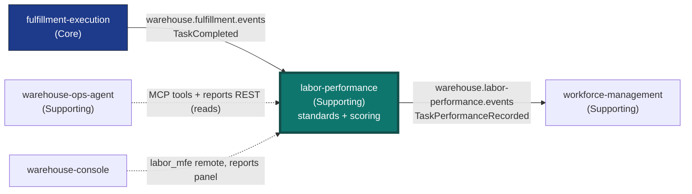

# Labor Performance

:::warning[Study project]
This documentation site is an educational Domain-Driven Design exercise. It
follows real industry-standard patterns and terminology, but it is **not a
production system** and is **not affiliated with, endorsed by, or
representative of any real-world
company**.
:::

**Labor Performance** is the fleet's context for engineered labor
standards and actual-vs-standard performance scoring. It is one of the
fifteen domain contexts in the `warehouse-systems` fleet (GitHub org
`IQVO`).

| | |
| --- | --- |
| Subdomain class | **Supporting**. It measures how well finished work matched a standard someone else configures ([ADR 0002](../adr/0002-new-bounded-context-not-extension-of-workforce-or-fulfillment.md), [Subdomain classification](../ddd/subdomain-classification.md)). |
| Tier | **WES**. The CloudEvents `type` segment is `wes`: `com.warehouse.wes.labor-performance.<entity>.<Event>`. |
| Inputs | Kafka only: `TaskCompleted` from `fulfillment-execution` on `warehouse.fulfillment.events`, plus operator calls to its own REST API. |
| Outputs | Its own REST API, a read-only reports API, a read-only MCP server, and CloudEvents on `warehouse.labor-performance.events` and `warehouse.labor-performance.analytics`. |
| Outbound calls | **None.** This context makes no REST or MCP call to any sibling, and a fitness test enforces that. |

## Why this context exists

Competitor research (Manhattan Active Labor Management, Blue Yonder
Workforce & Labor Management, both real, current products) converges on ONE
capability that neither `workforce-management` nor `fulfillment-execution` has:
**engineered labor standards** (an expected time per task type, e.g. "a PICK
should take 45s") and **actual-vs-standard performance scoring** ("this
associate's last PICK took 52s, 87% of standard"). Manhattan calls this
"Labor Monitoring". Blue Yonder calls it "align labor to demand with
real-time operational signals". Both treat it as a distinct product
capability, not a sub-feature of shift or schedule planning.

This is new domain logic, not a rename of anything that exists.
`workforce-management` owns "who is on shift, on which PATH, at what rate"
and deliberately stops at the path boundary: it never links an associate
to a task. `fulfillment-execution` owns the Task/Station lifecycle and has
no concept of a "standard" to measure a completion against. Neither
sibling context could host this without compromising its own boundary.
See [ADR 0002](../adr/0002-new-bounded-context-not-extension-of-workforce-or-fulfillment.md)
for the full reasoning.

## What it owns

| Capability | What that means here |
| --- | --- |
| **LaborStandard** | An append-only history of "how long a TaskType should take", with one active standard per TaskType at any time. Optionally includes a declared travel component ([ADR 0015](../adr/0015-optional-travel-component-on-labor-standard.md)). |
| **TaskPerformance** | One scored, already-completed task, frozen at ingestion time against whatever standard was active when it finished ([ADR 0004](../adr/0004-standard-frozen-at-completion-time-not-recomputed.md)). |
| **Scorecard** | A per-associate read model: task count, mean efficiency, per-TaskType breakdown, a trend and a coaching flag ([ADR 0005](../adr/0005-associate-trend-and-coaching-flag.md)). |
| **TaskTypePerformance** | A fleet-wide (all associates) read model per TaskType, including the measured mean duration even when no standard exists ([ADR 0006](../adr/0006-mean-actual-seconds-independent-of-standard.md)). |
| **IdlePeriod / Utilization** | The idle gap between one task and the next for each associate, derived from consecutive `TaskCompleted` events, plus windowed utilization read models per TaskType and per associate ([ADR 0014](../adr/0014-labor-utilization-idleness.md)). |
| **Labor Performance Report** | The analytical data product served by `cmd/labor-reports` ([ADR 0007](../adr/0007-analytical-data-product.md)). |

## What it deliberately does not own

- **It does not decide anything.** There is no automatic coaching and no
  automatic pay or bonus calculation. Manhattan does sell "Pay for
  Performance", but it is explicitly out of scope here. This context only
  makes the actual-vs-standard picture legible.
- **It does not gate or block anything in `fulfillment-execution`.** A
  below-standard associate can still claim tasks. This is visibility,
  not enforcement.
- **It does not talk to payroll, HR or scheduling systems.**
- **It does not call any sibling context synchronously.** No outbound
  REST or MCP client exists in this repo
  ([ADR 0003](../adr/0003-kafka-choreography-consumer-of-fulfillment-execution.md)).

## What runs today

The code on `develop` ships four Go binaries and one frontend remote. See
[Architecture](./architecture.md) for how they fit together.

| Process | Port (default) | What it does |
| --- | --- | --- |
| `cmd/labor` | `:8080` (`HTTP_ADDR`) | The OLTP service. Serves the REST API (`POST /standards`, `GET /standards/{taskType}`, scorecard, task-type performance, two utilization reads, `/healthz`, `/readyz`). Consumes `warehouse.fulfillment.events` (group `labor-performance`, DLQ `warehouse.fulfillment.events.dlq`). Runs the transactional-outbox relay and the housekeeping sweeper. |
| `cmd/mcp` | `:8090` (`MCP_ADDR`) | MCP server over Streamable HTTP: four read-only [tools](../mcp/tools.md), the `scorecard://labor/{associateId}` resource template, the `review_associate_performance` prompt and `GET /healthz`. No write tool. |
| `cmd/labor-projector` | `:8091` (`ADMIN_ADDR`, `/healthz` only) | The only writer of the analytical database. Consumes `warehouse.labor-performance.analytics` (group `labor-performance-analytics`, from the earliest offset) into `labor_performance_rollup`. |
| `cmd/labor-reports` | `:8092` (`HTTP_ADDR`) | Read-only reports API: `GET /reports/performance`, `GET /reports/performance/freshness`, `GET /healthz` ([Runbook](../operations/runbook.md#reports-api-cmdlabor-reports)). |
| `web/` (`labor_mfe`) | — | Module Federation remote mounted by `warehouse-console` at `/labor`. It calls this service's own OLTP API only. |

Every write comes either from the Kafka consumer (`RecordTaskPerformance`)
or from `POST /standards` (`DefineStandard`). With `DATABASE_URL` and
`EVENT_PUBLISHER=kafka` set, both commit their domain event into
`outbox_events` in the same transaction, and the relay publishes it as a
CloudEvents 1.0 event in structured mode to `warehouse.labor-performance.analytics`.
`TaskPerformanceRecorded` also goes to `warehouse.labor-performance.events`.
No REST, reports or MCP surface is authenticated
([ADR 0012](../adr/0012-remove-rest-auth-layer.md)). See the full list in
[Use cases](../ddd/use-cases.md).

## How it fits the fleet

Source: `internal/adapters/kafka/cloudevents/cloudevents.go` (topics and
types). The neighbour classifications come from the warehouse-docs fleet
table.

This service subscribes to the same shared fan-out topic that
`wes-work-planning` already consumes from, and publishes its own
integration topic, which `workforce-management` consumes. Other contexts
read it through its own REST, reports and MCP surfaces. It never calls
them. See [Integration](../ecosystem/integration.md) for every edge and
the [Context map](../ecosystem/context-map.md) for the relationship
analysis.

## Where to go next

- **Run it:** [Quickstart](./quickstart.md), [Architecture](./architecture.md).
- **Operate it:** [Configuration](../operations/configuration.md),
  [Runbook](../operations/runbook.md),
  [Observability](../operations/observability.md),
  [Troubleshooting](../operations/troubleshooting.md).
- **Change it:** [Testing](../development/testing.md),
  [Use cases](../ddd/use-cases.md),
  [ADRs](../adr/about.md).
- **Understand the domain:** [Domain vision](../business-context/domain-vision.md),
  [Subdomain classification](../ddd/subdomain-classification.md),
  [DDD artifacts (ddd-crew)](../ddd/ddd-artifacts.md).
- **Integrate with it:** [Integration](../ecosystem/integration.md),
  [MCP tools](../mcp/tools.md),
  [API Reference](/docs/api-reference/rest/labor-performance-api) (generated
  from `apis/openapi.yaml`),
  [Reports API Reference](/docs/api-reference/rest-reports/labor-performance-reports-api)
  (generated from `apis/openapi-reports.yaml`),
  [MCP Governance Charter](../mcp/governance-charter.md).
